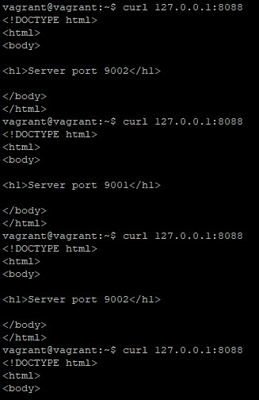
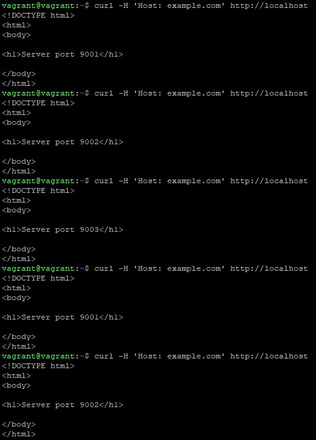
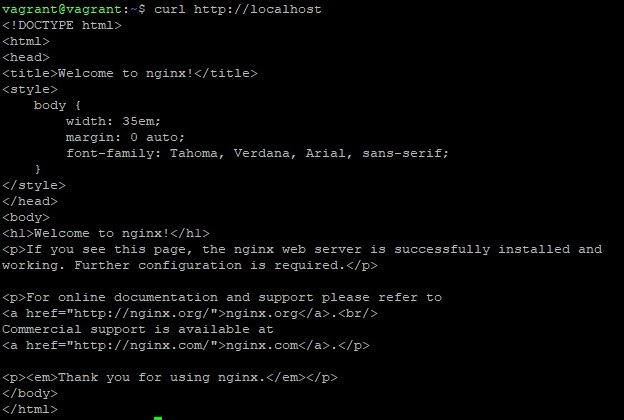

# Домашнее задание к занятию «Кластеризация и балансировка нагрузки» - Михалёв Сергей

------

### Задание 1
- Запустите два simple python сервера на своей виртуальной машине на разных портах
- Установите и настройте HAProxy, воспользуйтесь материалами к лекции
- Настройте балансировку Round-robin на 4 уровне.
### Результат
- Скриншот, где видно перенаправление запросов на разные серверы при обращении к HAProxy.
  * 

------

### Задание 2
- Запустите три simple python сервера на своей виртуальной машине на разных портах
- Настройте балансировку Weighted Round Robin на 7 уровне, чтобы первый сервер имел вес 2, второй - 3, а третий - 4
- HAproxy должен балансировать только тот http-трафик, который адресован домену example.local
### Результат
- Конфигурационный файл [haproxy](https://drive.google.com/file/d/12ZVDD7_rvoYfjX0Xzpnvam5QmkdY3lD-/view?usp=sharing),
- скриншоты, где видно перенаправление запросов на разные серверы при обращении к HAProxy c использованием домена example.local
   * 
- и без него.
  * 

------
